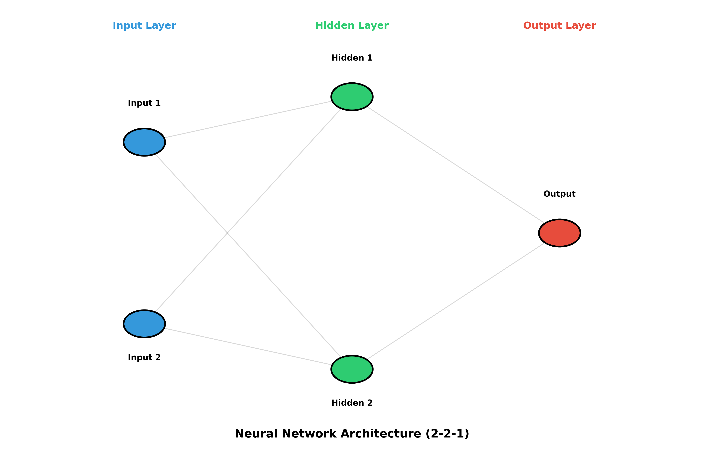

# Neural Networks Basics 

A comprehensive collection of basic neural network implementations from scratch using NumPy. This repository demonstrates fundamental concepts of neural networks including forward propagation, backpropagation, and gradient descent - all implemented without deep learning frameworks.



## Table of Contents

- [Overview](#overview)
- [Features](#features)
- [Installation](#installation)
- [Project Structure](#project-structure)
- [Examples](#examples)
- [Visualizations](#visualizations)
- [Learning Resources](#learning-resources)
- [Contributing](#contributing)
- [License](#license)

## Overview

This repository contains multiple implementations of neural networks, each demonstrating different concepts and architectures:

- **Simple Neural Network**: Basic 2-layer network with sigmoid activation
- **Layered Neural Network**: Modular implementation with separate layer handling
- **Object-Oriented Neural Network**: Full OOP implementation with training capabilities

All implementations are built from scratch using only NumPy, making them perfect for understanding the mathematics and mechanics behind neural networks.

## Features

- **Pure NumPy Implementation**: No high-level frameworks, just mathematics
- **Comprehensive Visualizations**: Architecture diagrams, training curves, and decision boundaries
- **Educational**: Well-commented code perfect for learning
- **Multiple Examples**: Different approaches to building neural networks
- **Training Visualization**: Track loss and performance over epochs

## Installation

### Prerequisites

- Python 3.8 or higher
- pip package manager

### Setup

1. **Clone the repository**:
   ```bash
   git clone https://github.com/Shubhaditya14/NeuralNetworksBasics.git
   cd NeuralNetworksBasics
   ```

2. **Create a virtual environment** (recommended):
   ```bash
   python -m venv env
   source env/bin/activate  # On Windows: env\Scripts\activate
   ```

3. **Install dependencies**:
   ```bash
   pip install -r requirements.txt
   ```

## Project Structure

```
nnbasics/
├── examples/                    # Example neural network implementations
│   ├── nn.py                   # Simple 2-layer neural network
│   ├── layerednn.py            # Layered neural network with modular design
│   └── newnn.py                # OOP neural network with full training
├── visualizations/              # Visualization tools
│   └── nn_visualizer.py        # Neural network visualization suite
├── assets/                      # Generated visualizations and images
│   ├── nn_architecture.png     # Network architecture diagram
│   ├── training_loss.png       # Training loss curve
│   └── decision_boundary.png   # Decision boundary visualization
├── requirements.txt             # Python dependencies
├── .gitignore                  # Git ignore file
└── README.md                   # This file
```

## Examples

### 1. Simple Neural Network (`examples/nn.py`)

A basic 2-layer neural network that learns XOR-like patterns:

```bash
python examples/nn.py
```

**Key Concepts**:
- Forward propagation
- Backpropagation
- Weight updates using gradient descent

### 2. Layered Neural Network (`examples/layerednn.py`)

A more modular approach with separate sigmoid function:

```bash
python examples/layerednn.py
```

**Key Concepts**:
- Activation functions
- Modular code design
- Error calculation and backpropagation

### 3. Object-Oriented Neural Network (`examples/newnn.py`)

A complete OOP implementation with training capabilities:

```bash
python examples/newnn.py
```

**Key Concepts**:
- Object-oriented design
- Neuron and Network classes
- Complete training loop with loss tracking
- Gender classification example

**Example Output**:
```
Epoch 0 loss: 0.326
Epoch 10 loss: 0.235
Epoch 20 loss: 0.184
...
Epoch 990 loss: 0.006
```

## Visualizations

### Generate All Visualizations

Run the visualization suite to create architecture diagrams, training curves, and decision boundaries:

```bash
python visualizations/nn_visualizer.py
```

This will generate:

1. **Network Architecture** (`assets/nn_architecture.png`)
   - Visual representation of the neural network structure
   - Shows input, hidden, and output layers
   - Displays connections between neurons

2. **Training Loss Curve** (`assets/training_loss.png`)
   - Loss (MSE) over training epochs
   - Shows convergence of the network

3. **Decision Boundary** (`assets/decision_boundary.png`)
   - Visualizes what the network has learned
   - Shows classification regions
   - Displays training data points

### Sample Visualizations

#### Network Architecture
The network uses a 2-2-1 architecture:
- **Input Layer**: 2 neurons (features)
- **Hidden Layer**: 2 neurons (with sigmoid activation)
- **Output Layer**: 1 neuron (binary classification)

#### Training Progress
Watch how the network learns over time by observing the loss curve decrease from ~0.3 to near 0.

## Learning Resources

### Understanding the Code

Each implementation demonstrates key neural network concepts:

1. **Forward Propagation**:
   ```python
   h1 = sigmoid(w1 * x[0] + w2 * x[1] + b1)
   output = sigmoid(w5 * h1 + w6 * h2 + b3)
   ```

2. **Loss Calculation** (Mean Squared Error):
   ```python
   loss = ((y_true - y_pred) ** 2).mean()
   ```

3. **Backpropagation**:
   ```python
   d_L_d_ypred = -2 * (y_true - y_pred)
   d_ypred_d_w5 = h1 * deriv_sigmoid(sum_o1)
   ```

4. **Weight Updates**:
   ```python
   w5 -= learn_rate * d_L_d_ypred * d_ypred_d_w5
   ```


## 📄 License

This project is open source and available under the MIT License.

## 🙏 Acknowledgments

This repository is created for educational purposes to help understand the fundamentals of neural networks. The implementations are inspired by various neural network tutorials and courses.

## 📬 Contact

For questions or feedback, please open an issue on GitHub.